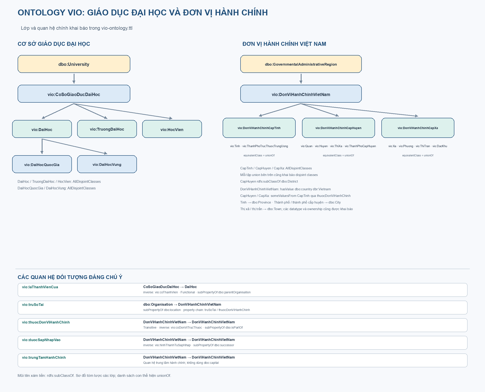
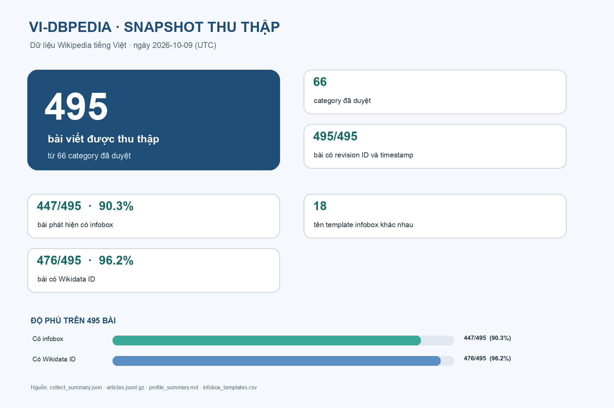
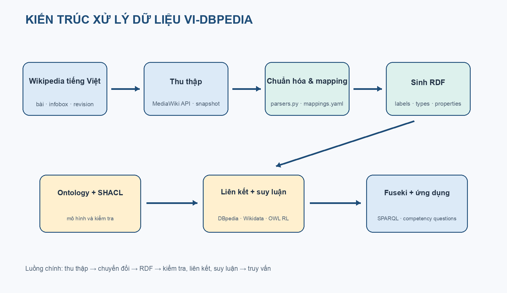

# XÂY DỰNG PHIÊN BẢN DBPEDIA CHO TIẾNG VIỆT

## Báo cáo môn học Semantic Web

**Sinh viên:** [Điền họ tên]  
**Mã số sinh viên:** [Điền MSSV]  
**Lớp:** [Điền lớp]  
**Giảng viên:** [Điền giảng viên]  
**Trường/Khoa:** [Điền trường và khoa]  
**Ngày hoàn thành:** 10/10/2026

> Thay các trường trong ngoặc vuông bằng thông tin của bạn. Số liệu chụp từ snapshot ngày 10/10/2026 giờ Việt Nam; không đại diện Wikipedia hiện tại.

## Tóm tắt

Báo cáo trình bày một nguyên mẫu chuyển một tập bài Wikipedia tiếng Việt thành dữ liệu RDF có thể truy vấn bằng SPARQL. Project thu thập 495 bài thuộc nhóm trường và cơ sở giáo dục đại học, tỉnh cũ và tỉnh/thành; chuẩn hóa infobox; tạo ontology tiếng Việt `vio:` và ánh xạ một phần sang DBpedia Ontology; xây dựng liên kết đến DBpedia tiếng Anh và Wikidata; kiểm tra SHACL; vật chất hóa một tập suy luận OWL RL; và cung cấp cấu hình Fuseki cùng mười truy vấn competency question.

Snapshot tạo 58.692 triple trong mười bộ dữ liệu; 332 bài được gán lớp miền; có 199 liên kết DBpedia và 476 liên kết Wikidata; SHACL báo 0 vi phạm. Bộ suy luận sinh 8.335 triple mới. Bộ so khớp ghi precision 99,4%, recall 97,5%, F1 98,4% trên nhóm có đáp án liên ngôn ngữ đã kiểm tra. Các chỉ số có giới hạn: ngưỡng được tinh chỉnh trên cùng tập tham chiếu, còn 6 liên kết heuristic bổ sung chưa được chấm thủ công. Đây là nguyên mẫu cục bộ, chưa phải dịch vụ Linked Data ổn định trên Internet.

**Từ khóa:** Semantic Web, RDF, DBpedia, Wikipedia tiếng Việt, ontology, SPARQL, liên kết dữ liệu.

## 1. Giới thiệu

Wikipedia thuận tiện cho người đọc nhưng thông tin nằm rải trong văn bản và infobox của từng trang. Điều đó làm khó việc trả lời câu hỏi liên hợp như các trường đại học tại Hà Nội, trường thành viên của đại học vùng, hay so sánh dữ liệu giữa hai kho tri thức. Semantic Web biểu diễn tài nguyên và quan hệ bằng URI cùng RDF, nhờ đó có thể truy vấn đồ thị dữ liệu thay vì chỉ dò từng trang.

Mục tiêu là xây dựng nguyên mẫu DBpedia tiếng Việt có thể tái lập từ dữ liệu đã thu thập: trích thông tin có cấu trúc từ Wikipedia, ánh xạ vào ontology, tạo RDF, liên kết thực thể, kiểm tra chất lượng, suy luận và truy vấn SPARQL. Phạm vi thực nghiệm là 495 bài thuộc nhóm giáo dục đại học và địa giới cấp tỉnh; đây không phải bản bao phủ toàn bộ Wikipedia tiếng Việt.

Các câu hỏi năng lực gồm: tỉnh/thành có dân số cao nhất; tỉnh cũ và thời gian tồn tại; cơ sở giáo dục tại Hà Nội; thành viên đại học quốc gia/vùng; số trường theo địa phương; phân bố sở hữu; tác dụng suy luận; liên kết DBpedia/Wikidata; đối chiếu kiểu và dân số với DBpedia tiếng Anh. Kết quả lưu trong `serve/reports/queries.md`.

## 2. Cơ sở lý thuyết và thiết kế

### 2.1 RDF, RDFS, OWL và Linked Data

RDF biểu diễn dữ kiện thành bộ ba chủ thể–vị từ–đối tượng. Tài nguyên được định danh bằng URI; literal có thể mang ngôn ngữ hoặc kiểu dữ liệu. Turtle và N-Triples là các cú pháp tuần tự hóa RDF. RDFS cung cấp lớp, thuộc tính, phân lớp, domain và range. Domain/range có thể dẫn đến suy ra kiểu; chúng không tự làm nhiệm vụ xác thực dữ liệu.

OWL thêm ngữ nghĩa phong phú hơn, như thuộc tính nghịch đảo, tương đương và chuỗi thuộc tính. Theo Open World Assumption, thiếu triple không có nghĩa triple đó sai. SHACL được dùng riêng để kiểm tra dữ liệu theo shape đã chọn. `owl:sameAs` khẳng định hai URI đồng nhất về ngữ nghĩa nên chỉ dùng khi có căn cứ đối chiếu. Một tệp RDF cục bộ chưa tự chứng minh việc công bố Linked Open Data trên web.

### 2.2 Ontology

Ontology miền ở `ontology/vio-ontology.ttl`; lớp chính gồm `vio:TruongDaiHoc`, `vio:DaiHoc`, `vio:DaiHocQuocGia`, `vio:DaiHocVung`, `vio:HocVien`, `vio:Tinh`, `vio:ThanhPhoTrucThuocTrungUong`. Project tái sử dụng lớp và thuộc tính `dbo:` khi tương thích, đồng thời giữ lớp `vio:` để mô tả phân biệt của dữ liệu đầu vào. Bản DBpedia được vá nằm ở `ontology/dbo-patched.ttl`; `ontology/prepare_dbo.py` và `ontology/validate.py` hỗ trợ chuẩn bị và kiểm tra.

Trường đại học là một tổ chức, còn địa điểm trụ sở là thực thể riêng; quan hệ giữa trường và tỉnh không có nghĩa chúng là cùng tài nguyên. Các lớp không bị khai báo rời nhau nếu thực thể có thể đồng thời thuộc nhiều vai trò. Nhãn tiếng Việt hỗ trợ hiển thị, còn URI dựa trên tên trang. Tên giống nhau không đủ căn cứ để hợp nhất hai tài nguyên.

Kiểm thử ontology trong `report/evidence/ontology_validation.txt` đạt 20/20 phép kiểm tra. Kết quả xác nhận các điều kiện được viết trong script, không phải chứng minh ontology hoàn hảo hay nhất quán toàn cục với mọi dữ liệu DBpedia.

## 3. Thu thập và chuyển đổi dữ liệu

### 3.1 Thu thập

`collect/collect_api.py` dùng MediaWiki API với User-Agent cấu hình cho VIDBPEDIA. Danh mục gốc nằm trong `collect/categories.txt`; bộ thu đi theo độ sâu giới hạn và ghi bài, nội dung, infobox, danh mục, liên kết ngôn ngữ, Wikidata ID và revision. Dữ liệu nén nằm trong `collect/data/`. `collect/reports/collect_summary.json` ghi 495 bài từ 66 danh mục, 200 liên kết ngôn ngữ và 476 mã Wikidata. Cả 495 bài đều có revision ID và timestamp; thời điểm thu thập là 2026-10-10 05:06 giờ Việt Nam.

Trong snapshot ngày 09/10/2026 UTC, 447/495 bài phát hiện có infobox. Đây là chỉ số về độ phủ infobox, không phải độ chính xác trích xuất.

### 3.2 Mapping và RDF

`transform/mappings.yaml` khai báo ánh xạ tham số infobox sang RDF; `transform/parsers.py` xử lý giá trị và `transform/transform.py` sinh các tệp trong `transform/output/`. Mapping chuẩn hóa một số ngày, số, tọa độ, loại hình và đối tượng có liên kết. Khi nguồn chỉ có năm, hệ thống giữ độ chính xác ở mức năm thay vì tự gán ngày/tháng. Giá trị không ánh xạ được có thể giữ trong bộ thuộc tính infobox thô.

Kết quả gồm 58.692 triple: `page-links` 40.619; `infobox-properties` 8.236; `provenance` 3.465; `categories` 1.952; `mappingbased-literals` 2.187; `mappingbased-objects` 863; `labels` 495; `abstracts` 495; `instance-types` 332; `geo-coordinates` 48. Page-links chiếm phần lớn, còn các triple mapping miền hữu ích cho truy vấn liên hợp ít hơn.

332 bài được gán lớp miền: 190 trường đại học, 88 tỉnh, 36 học viện, 9 thành phố trực thuộc trung ương, 5 đại học, 2 đại học quốc gia và 2 đại học vùng. 163 bài còn lại vẫn có dữ liệu trang tổng quát nhưng chưa được gán lớp miền. Thống kê mapping trong `transform/reports/transform_summary.md` cho thấy độ phủ khác nhau; ví dụ tọa độ có 23/36 giá trị chuẩn hóa ở profile trường học và loại hình 167/197. Có dữ liệu RDF không đồng nghĩa mọi thuộc tính được trích xuất đầy đủ.

### 3.3 Provenance

Các triple nguồn ghi định danh bài, revision và thời điểm tạo để truy ngược về phiên bản Wikipedia. Provenance hiện được tổ chức theo tài nguyên/phiên bản, không gắn metadata đầy đủ cho từng triple; phiên bản mapping cũng chưa được lưu cho từng kết quả. Đây là giới hạn khi tái lập quyết định trích xuất riêng lẻ.

## 4. Liên kết thực thể

`link/link.py` tạo liên kết trực tiếp từ langlinks/Wikidata và xử lý ứng viên DBpedia; `link/validate_links.py` kiểm tra đích. Bộ so khớp trong `link/match.py` dùng tên, kiểu, homepage, địa lý và năm. Phần so tên trong code thực tế là `SequenceMatcher.ratio()`; không phải Levenshtein dù một số chú thích gọi như vậy. Điểm tổng hợp dùng trọng số và ngưỡng; luật nhận liên kết mới yêu cầu tên rất giống kèm chứng cứ độc lập.

Snapshot có 200 liên kết DBpedia ban đầu và 476 Wikidata. Sau kiểm tra, 193 liên kết DBpedia trực tiếp được giữ; thêm 6 liên kết heuristic, tổng cộng 199 trong graph cuối. 24 đề xuất mới chưa có liên kết liên ngôn ngữ; 6 được nhận theo luật tự động. `link/reports/new_links_review.csv` có 19 dòng xem xét, chưa được đánh giá thủ công. `owl:sameAs` chỉ phù hợp khi hai URI cùng chỉ một thực thể.

### 4.1 Đánh giá matcher

Tập tham chiếu có 160 thực thể với đáp án; 157 đáp án có trong tập ứng viên (trần recall 98,1%). Ở ngưỡng 0,75, có 181 dự đoán cho nhóm có đáp án, 156 đúng: precision 99,4%, recall 97,5%, F1 98,4%. Báo cáo ghi nhận một ghép sai và ba bỏ sót.

Đây là kết quả nội bộ có nguy cơ lạc quan vì luật được điều chỉnh sau khi xem lỗi trên cùng tập tham chiếu. Precision này không đánh giá sáu liên kết heuristic mới; các tệp review chưa có nhãn chuyên gia. Cần xem đây là kiểm tra ban đầu, không phải ước lượng độc lập trên toàn bộ dữ liệu.

## 5. Kiểm tra chất lượng và suy luận

Shape SHACL nằm ở `transform/shapes.ttl`; `transform/check_quality.py` chạy kiểm tra. Quy tắc bao gồm nhãn tiếng Việt, kiểu/range theo chính sách, giá trị ngày/số, quan hệ dạng URI và tọa độ trong giới hạn hợp lệ khi có đủ cặp. Snapshot có 0 vi phạm trên 58.692 triple. Điều đó nghĩa dữ liệu vượt các shape hiện có; không bảo đảm mọi thông tin đúng sự thật hoặc mọi trường miền đã được thu thập.

`serve/materialize.py` dùng OWL-RL tạo `serve/output/inferred.nt` với 8.335 triple mới từ ontology và một phần graph dữ liệu. Ví dụ gồm truyền kiểu qua phân cấp lớp, suy ra quan hệ nghịch đảo cho thành viên và luật chuỗi thuộc tính đã khai báo. CQ7 cho thấy kiểu DBpedia như `dbo:University` và `dbo:Organisation` có thể suy ra từ lớp `vio:`. Kết quả phụ thuộc ontology và tập đầu vào; đây không phải khẳng định mọi suy luận OWL 2 đều được hỗ trợ.

`serve/reports/inconsistencies.md` kiểm tra xung đột các cặp lớp rời nhau trên tài nguyên cục bộ. Phép kiểm tra chuyên biệt này không tương đương chứng minh toàn bộ đồ thị OWL nhất quán.

## 6. SPARQL và ứng dụng

`serve/queries/` chứa mười truy vấn competency question; `serve/reports/queries.md` ghi kết quả từ endpoint cục bộ `http://localhost:3030/vi-dbpedia/sparql`. CQ3 trả 53 cơ sở giáo dục tại Hà Nội; CQ4 liệt kê thành viên của bốn đại học quốc gia/vùng; CQ5 đếm trường theo 23 tỉnh/thành; CQ8 trình bày 25 liên kết ngoài; CQ9–CQ10 dùng federated query cần mạng để đối chiếu DBpedia tiếng Anh.

Đây là bằng chứng truy vấn chạy trên snapshot đã lưu. Chúng chưa được đối chiếu bộ đáp án chuẩn độc lập, nên số dòng không đồng nghĩa độ đúng tuyệt đối. CQ1 lọc theo thông tin giải thể có/không có trong graph, không thay thế việc xác minh nguồn hành chính chính thức.

Project có cấu hình Fuseki và mã ứng dụng trong `serve/`. `serve/ld_server.py` triển khai tra cứu/trình bày dữ liệu theo nhiều định dạng; trong quá trình lập báo cáo chưa xác minh giao diện bằng phiên trình duyệt, nên không coi ảnh UI là bằng chứng kiểm thử. Dịch vụ chạy localhost, URI công khai chưa được triển khai. Project chưa chứng minh mức công bố 4★/5★ thực tế trên web.

## 7. Đánh giá tổng thể

| Hạng mục | Kết quả snapshot | Giới hạn chính |
|---|---:|---|
| Thu thập | 495 bài, 66 danh mục | Tập hẹp, độ sâu danh mục giới hạn |
| Theo dõi revision | 495/495 bài | Chưa lưu mọi phiên bản trung gian |
| Mapping lớp | 332/495 bài | 163 bài chưa có lớp miền |
| RDF | 58.692 triple | Page-links chiếm đa số |
| SHACL | 0 vi phạm | Shape không kiểm tra chân lý ngoài đời |
| Liên kết ngoài | 199 DBpedia, 476 Wikidata | 6 liên kết heuristic chưa được người chấm |
| Matcher | P 99,4%; R 97,5%; F1 98,4% | Tập đánh giá chưa độc lập |
| Suy luận | 8.335 triple mới | Luật và graph đầu vào giới hạn |
| Truy vấn | 10 CQ có kết quả lưu | Chưa có đáp án độc lập để chấm đúng |
| Công bố | Fuseki localhost | Chưa có URI công khai ổn định |

Project thể hiện chuỗi xử lý Semantic Web từ thu thập đến truy vấn, đồng thời giữ dữ liệu nguồn và báo cáo kiểm tra. Đóng góp trong phạm vi đồ án gồm mapping infobox tiếng Việt, liên kết ngoài, truy vết revision, SHACL và suy luận. Để đánh giá mạnh hơn cần tập gán nhãn độc lập, chấm thủ công liên kết mới, so baseline trên cùng test set, và đo độ đúng từng CQ bằng đáp án kỳ vọng.

## 8. Kết luận và hướng phát triển

Project đã hiện thực nguyên mẫu DBpedia tiếng Việt trên 495 trang, biểu diễn 58.692 triple, kiểm tra shape, liên kết tài nguyên và trả lời các câu hỏi SPARQL. Dữ liệu có revision metadata và một phần quan hệ suy luận. Kết quả xác nhận tính khả thi kỹ thuật trong snapshot; chưa đủ kết luận bao phủ hoặc độ chính xác tương đương DBpedia tiếng Anh, và chưa phải dịch vụ Linked Data công khai hoàn chỉnh.

Hướng tiếp theo là mở rộng phạm vi có kiểm soát; bổ sung kiểm thử biến thể infobox; xây dựng tập chuẩn độc lập cho extraction/linking; lưu provenance cho mapping và từng quyết định chuẩn hóa; thêm kiểm thử hồi quy cho CQ; kiểm tra mâu thuẫn OWL trên graph thực; triển khai URI có nội dung mô tả ổn định và chính sách giấy phép được xác minh.

## Tài liệu tham khảo

### Slide môn học

1. *01 Intro*, *02 RDF*, *03 RDFS*, *04 LOD*, *05 OWL*, *06 OWL2*, *07 Knowledge Modeling*, tài liệu môn học do sinh viên cung cấp, phiên bản 2024.

### Đặc tả và tài liệu chính thức

2. W3C, [RDF 1.1 Concepts and Abstract Syntax](https://www.w3.org/TR/rdf11-concepts/).
3. W3C, [RDF Schema 1.1](https://www.w3.org/TR/rdf-schema/).
4. W3C, [OWL 2 Profiles](https://www.w3.org/TR/owl2-profiles/).
5. W3C, [SPARQL 1.1 Query Language](https://www.w3.org/TR/sparql11-query/).
6. W3C, [Shapes Constraint Language (SHACL)](https://www.w3.org/TR/shacl/).
7. W3C, [PROV-O](https://www.w3.org/TR/prov-o/) và [VoID](https://www.w3.org/TR/void/).
8. Apache Jena, [Fuseki documentation](https://jena.apache.org/documentation/fuseki2/).
9. DBpedia Association, [Ontology](https://www.dbpedia.org/resources/ontology/).
10. MediaWiki, [API:Revisions](https://www.mediawiki.org/wiki/API:Revisions).
11. T. Berners-Lee, [Linked Data](https://www.w3.org/DesignIssues/LinkedData.html).

### Tệp bằng chứng của project

12. `collect/reports/collect_summary.json`; `transform/reports/transform_summary.md`; `transform/reports/quality_check.md`.
13. `link/reports/link_summary.md`; `link/reports/link_validation.md`; `link/reports/match_evaluation.md`.
14. `serve/reports/queries.md`; `serve/reports/inconsistencies.md`; `report/evidence/ontology_validation.txt`.

## Phụ lục A. Bản đồ tệp

| Công đoạn | Tệp/Thư mục | Vai trò |
|---|---|---|
| Thu thập | `collect/collect_api.py`, `collect/categories.txt` | Lấy bài, metadata, revision và liên kết |
| Dữ liệu gốc | `collect/data/` | Snapshot đầu vào nén |
| Ontology | `ontology/vio-ontology.ttl` | Lớp và thuộc tính tiếng Việt |
| Mapping | `transform/mappings.yaml`, `transform/parsers.py` | Quy tắc chuyển đổi và chuẩn hóa |
| Sinh RDF | `transform/transform.py`, `transform/output/` | Các graph RDF |
| Chất lượng | `transform/shapes.ttl`, `transform/check_quality.py` | Kiểm tra SHACL |
| Liên kết | `link/link.py`, `link/match.py`, `link/output/` | Liên kết ngoài và so khớp |
| Suy luận | `serve/materialize.py`, `serve/output/inferred.nt` | Đóng suy luận OWL RL |
| Truy vấn | `serve/queries/`, `serve/reports/queries.md` | CQ và kết quả |
| Endpoint | `serve/config.ttl`, `serve/start_fuseki.sh` | Cấu hình Fuseki cục bộ |

## Phụ lục B. Kịch bản demo

1. Mở bài nguồn cùng revision; chỉ ra infobox và dòng mapping.
2. Mở URI trong RDF, phân biệt literal nhãn/ngày với URI quan hệ.
3. Chạy CQ3 để thấy truy vấn nối trường và địa điểm; snapshot trả 53 dòng.
4. Chạy CQ4 hoặc CQ7 để minh họa quan hệ/kiểu được suy ra.
5. Mở báo cáo SHACL và giải thích 0 vi phạm theo các shape hiện có.
6. Mở CQ8/CQ9 để minh họa liên kết ngoài; federated query cần mạng.
7. Nêu giới hạn: tập nhỏ, matcher chưa đánh giá độc lập, endpoint cục bộ.
